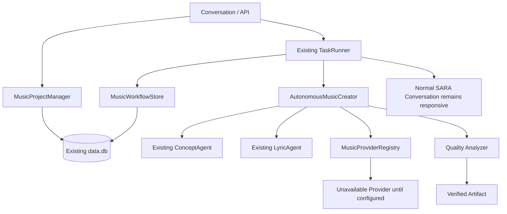

# SARA Autonomous Music Creator Phase 2 Report

Date: 2026-09-06

## Files Created

- `AUTONOMOUS_MUSIC_CREATOR_AUDIT.md`
- `src/services/music_studio/autonomousTypes.ts`
- `src/services/music_studio/provider_registry.ts`
- `src/services/music_studio/quality_analyzer.ts`
- `src/services/music_studio/workflow_store.ts`
- `src/services/music_studio/autonomous_creator.ts`
- `src/services/music_studio/content_preparation.ts`
- `tests/music-creator-phase2.test.ts`
- `tests/music-content-preparation.test.ts`
- `src/components/MusicProjectsPanel.tsx`

## Files Modified

- `server_state.ts`: added the durable `music_workflow_tasks` table to the existing SQL bridge schema.
- `server_task_manager.ts`: routes music workflow tasks through the existing persistent TaskRunner.
- `server_full.ts`: added project creation/list/status and provider-health APIs; enqueues music work through the existing TaskRunner.
- `server_full.ts`: added publishing-preparation and explicit approval endpoints.
- `src/services/music_studio/project_manager.ts`: parameterized project reads and list queries.
- `App.tsx`: added the Music Projects panel to the existing Quick Chat/panel stack.

## Existing Systems Reused

- Existing `data/data.db` SQL.js persistence.
- Existing `music_projects` and `music_assets` tables.
- Existing `MusicProjectManager` and `MusicAssetManager`.
- Existing Gemini-backed `ConceptAgent` and `LyricAgent`.
- Existing `server_state` task records and `server_task_manager` background runner.
- Existing conversation IDs, task metadata, logging, and restart recovery mechanisms.
- Existing ToolRouter, policy, verification, browser, desktop, and security boundaries remain unchanged.

## Actually Working

- Persistent music project creation with unique project IDs.
- Structured creative brief fields: theme, genre, mood, language, audience, duration, energy, vocal style, and broad reference characteristics.
- Durable workflow task records with stage, status, progress, retry count, checkpoint, provider job ID, and error fields.
- Background TaskRunner enqueueing without blocking conversation requests.
- Restart-resumable workflow metadata and stage checkpoints.
- Gemini concept and lyrics stages reuse existing agents.
- Provider health endpoint and explicit unavailable-provider behavior.
- Quality analyzer checks artifact existence, container signature, and basic duration availability.
- YouTube and Instagram draft metadata preparation is persisted in existing project metadata.
- Publishing readiness checks require a real project video asset and explicit user approval.
- Approval state is persisted with approver and timestamp.
- Minimal Music Projects UI shows real project stage, workflow progress, errors, and publishing readiness actions.
- SQL query parameterization for music project reads.

## APIs Added

- `POST /api/music/projects`
- `GET /api/music/projects`
- `GET /api/music/projects/:projectId`
- `GET /api/music/providers/health`
- `POST /api/music/projects/:projectId/prepare-publishing`
- `POST /api/music/projects/:projectId/approve-publishing`

## Real Providers Integrated

None. No production music, vocal, artwork, video-rendering, YouTube publishing, Instagram publishing, or analytics provider credentials/API contract was present in the repository. The registry intentionally exposes an unavailable provider rather than fabricating media or success.

## Requires Credentials or Provider Adapters

- Instrumental/music generation.
- Singing/vocal generation.
- Artwork generation.
- Video rendering/encoding.
- Official YouTube upload and verification.
- Instagram publishing and verification.
- Platform analytics retrieval.

## User Approval Required

- Public YouTube publication.
- Instagram publication.
- Deletion or replacement of published content.
- Paid provider generation credits.
- Account setting changes.

The current Phase 2 APIs only create and enqueue drafts; they do not publish content.

## Known Limitations

- The workflow currently runs concept, lyrics, then provider selection. It does not claim completion after the unavailable provider boundary.
- Retry handling is available in the shared task architecture, but provider-specific retry/backoff and resumable remote jobs require a real adapter.
- Artifact quality analysis is intentionally conservative and currently validates WAV/container evidence rather than performing full loudness, clipping, silence, language, and lyric-semantic analysis.
- Cover art, video, publishing, comments, analytics, creator learning, and project dashboard UI are not implemented in this slice.
- The minimal project/task UI is implemented; full media previews and publishing controls remain intentionally absent until providers exist.
- Publishing preparation is implemented, but actual upload is intentionally not implemented until an official provider adapter and verified final video are available.
- `server_full.ts` is the production build entry point; the parallel legacy `server.ts` was not changed.

## Explicitly Mocked

None. No mock media, fake progress, fake provider completion, or fake publishing response was added.

## Tests Executed

- `npx tsc --noEmit`: passed.
- `npx tsx --test tests/singer-mode.test.ts tests/music-creator-phase2.test.ts tests/music-content-preparation.test.ts`: 6/6 passed.
- `npm run build`: passed for Vite and the bundled production server.

## Architecture

